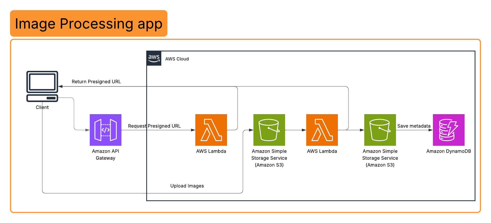

# Image Processing Application
**Engineer:** Shahd Galal Anwar  
**Region:** `eu-central-1` (Frankfurt)  

---

## 1. Executive Summary
This project demonstrates a **highly scalable, event-driven architecture** designed to automate image ingestion and optimization. By leveraging AWS serverless primitives, the system achieves a "zero-maintenance" footprint while ensuring cost-efficiency and high availability for global web applications.

---

## 2. Solution Architecture
The pipeline follows a decoupled, asynchronous pattern to minimize client-side latency and maximize backend throughput.
 

### **The Workflow Lifecycle**
1. **Secure Handshake:** The client requests an upload handshake via **Amazon API Gateway**. 
2. **Delegated Authorization:** A **Lambda function** (`GetPresignedUrl`) issues an **S3 Presigned URL**, enabling secure, temporary write-access directly to the cloud without exposing long-term AWS credentials.
3. **Direct Ingestion:** The browser transmits the raw image directly to the **Source S3 Bucket**, reducing server-side compute overhead.
4. **Asynchronous Trigger:** S3 Event Notifications invoke the **ImageProcessor Lambda** immediately upon object finalization.
5. **Transformation & Persistence:** * **Dynamic Bootstrapping:** The processor initializes the `Pillow` library within the ephemeral `/tmp` directory to maintain a lightweight deployment package.
    * **Image Optimization:** Assets are resized and optimized for web delivery.
    * **Metadata Indexing:** Final asset URIs and timestamps are committed to **Amazon DynamoDB**, while the optimized file is stored in the **Destination S3 Bucket**.

---

## 3. Technical Specification

| Layer | Service | Justification |
| :--- | :--- | :--- |
| **Compute** | AWS Lambda | Event-driven execution; zero costs during idle periods. |
| **Storage** | Amazon S3 | Durable, scalable object storage with built-in lifecycle triggers. |
| **Database** | Amazon DynamoDB | Low-latency NoSQL storage for rapid metadata retrieval. |
| **API Layer** | Amazon API Gateway | Managed RESTful entry point with integrated CORS handling. |
| **Security** | IAM & STS | Least-privileged access via execution roles and presigned URLs. |

---

## 4. Architectural Decisions & Optimization

### **Security & Regional Compliance**
To comply with the strict security protocols of the **Frankfurt (eu-central-1)** region, the Boto3 SDK was explicitly configured to use **S3 Signature Version 4**. This ensures all requests are signed with high-entropy cryptographic hashes, mitigating the risk of unauthorized access.

### **Performance Engineering**
* **Cold Start Mitigation:** By installing image processing dependencies at runtime within the `/tmp` storage, the Lambda deployment package remains under 5MB. This significantly reduces cold-start latency compared to traditional heavy deployment packages.
* **Elastic Scalability:** The architecture is natively elastic; it scales automatically from zero to thousands of concurrent requests without manual intervention or server provisioning.

---

## 5. Deployment & Visuals
* **CORS Management:** Implemented granular bucket policies to allow secure cross-origin requests from the web frontend.
* **Observability:** Integrated with **Amazon CloudWatch** for real-time monitoring, error tracking, and performance logging.

---
* [Live Demonstration Video](#) : https://drive.google.com/file/d/1uIvUUqtb0i533lKYKEYPC8yLgVxB6P9U/view?usp=sharing
